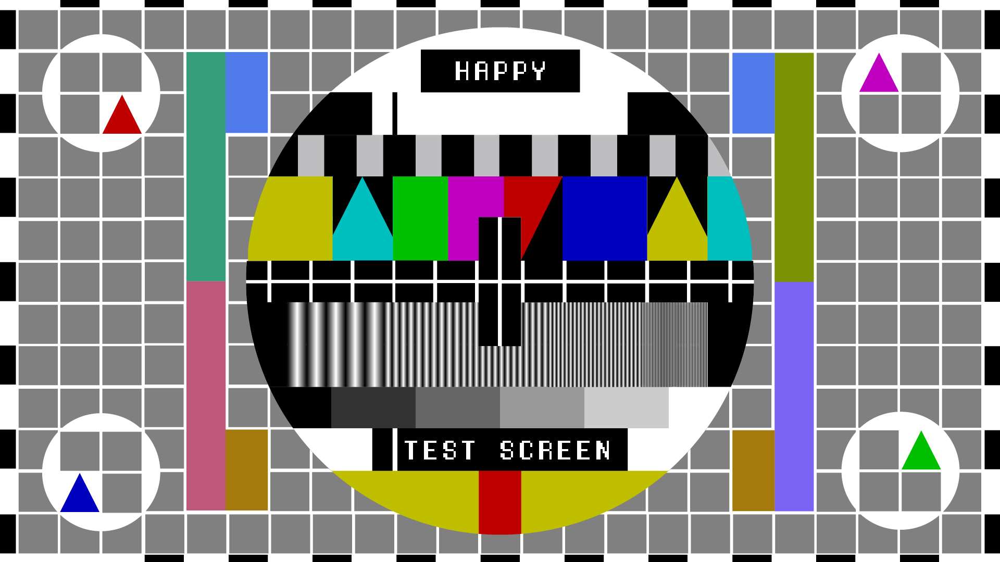

reStructuredText Directives
=========================================================================

See: `reStructuredText Directives <https://docutils.sourceforge.io/docs/ref/rst/directives.html>`_

.. contents:: Table of Contents
  :depth: 3
  :local:
  :backlinks: none

Admonitions
---------------------------------------

Specific Admonitions
^^^^^^^^^^^^^^^^^^^^

.. DANGER::
   Beware killer rabbits!

.. note:: This is a note admonition.

   This is the first line of the second paragraph.

   - The note contains all indented body elements
     following.
   - It includes this bullet list.

.. warning:: This is a warning admonition.
   This is the second line of the first paragraph.

Generic Admonition
^^^^^^^^^^^^^^^^^^^^

.. admonition:: And, by the way...

   You can make up your own admonition too.

Images
---------------------------------------

Image
^^^^^^^^^^^^^^^^^^^^^^^^^^^^^^^^^^^^^^^^^

+------------------------+-----------------------+
| Symbol                 | Meaning               |
+========================+=======================+
| .. image:: img/1.png   | Campground            |
+------------------------+-----------------------+
| .. image:: img/1.png   | Lake                  |
+------------------------+-----------------------+

Figure
^^^^^^^^^^^^^^^^^^^^^^^^^^^^^^^^^^^^^^^^^

Captioned figures are not supported.

Body Elements
---------------------------------------

Topic
^^^^^^^^^^^^^^^^^^^^^^^^^^^^^^^^^^^^^^^^^

.. topic:: Topic Title

    Subsequent indented lines comprise
    the body of the topic, and are
    interpreted as body elements.

Sidebar
^^^^^^^^^^^^^^^^^^^^^^^^^^^^^^^^^^^^^^^^^

This is an example of a sidebar.

.. sidebar:: Optional Sidebar Title
   :subtitle: Optional Sidebar Subtitle

   Subsequent indented lines comprise
   the body of the sidebar, and are
   interpreted as body elements.

Continuing text associated with the sidebar.

More continuing text associated with the sidebar.
More continuing text associated with the sidebar.
And more continuing text associated with the sidebar.
Still more continuing text associated with the sidebar.
Final continuing text associated with the sidebar.

Line Block
^^^^^^^^^^^^^^^^^^^^^^^^^^^^^^^^^^^^^^^^^

"To Ma Own Beloved Lassie: A Poem on her 17th Birthday", by
Ewan McTeagle (for Lassie O'Shea):

    .. line-block::

        Lend us a couple of bob till Thursday.
        I'm absolutely skint.
        But I'm expecting a postal order and I can pay you back
            as soon as it comes.
        Love, Ewan.

Parsed Literal Block
^^^^^^^^^^^^^^^^^^^^^^^^^^^^^^^^^^^^^^^^^

NOT SUPPORTED

Code
^^^^^^^^^^^^^^^^^^^^^^^^^^^^^^^^^^^^^^^^^

.. code:: python

  def my_function():  // my demo function
      "just a test"
      print 8/2

.. code:: console

  sudo /etc/init.d/alation shell

.. code:: bash

  #!/bin/bash

  echo -e "Please enter your name: "
  read name
  echo "Nice to meet you $name"

.. code:: json

  {
     "anObject": {
        "numericProperty": -122,
        "stringProperty": "An offensive \" is problematic",
        "nullProperty": null,
        "booleanProperty": true,
        "dateProperty": "2011-09-23"
     },
     "arrayOfObjects": [
        {
           "item": 1
        },
        {
           "item": 2
        },
        {
           "item": 3
        }
     ],
     "arrayOfIntegers": [
        1,
        2,
        3,
        4,
        5
     ]
  }

.. code-block:: sql

  CREATE TABLE CUSTOMERS(
     ID   INT              NOT NULL,
     NAME VARCHAR (20)     NOT NULL,
     AGE  INT              NOT NULL,
     ADDRESS  CHAR (25) ,
     SALARY   DECIMAL (18, 2),       
     PRIMARY KEY (ID)
  );

Math
^^^^^^^^^^^^^^^^^^^^^^^^^^^^^^^^^^^^^^^^^

.. math::

  α_t(i) = P(O_1, O_2, … O_t, q_t = S_i λ)

Rubric
^^^^^^^^^^^^^^^^^^^^^^^^^^^^^^^^^^^^^^^^^

.. rubric:: An informal heading that doesn't correspond to the document's structure.

Epigraph
^^^^^^^^^^^^^^^^^^^^^^^^^^^^^^^^^^^^^^^^^

.. epigraph::

   No matter where you go, there you are.

   -- Buckaroo Banzai

And, continuing.

Highlights
^^^^^^^^^^^^^^^^^^^^^^^^^^^^^^^^^^^^^^^^^

.. highlights::

   No matter where you go, there you are.

   No matter where you went, there you were.

And, continuing.

Pull-Quote
^^^^^^^^^^^^^^^^^^^^^^^^^^^^^^^^^^^^^^^^^

.. pull-quote::

   No matter where you go, there you are.

   No matter where you went, there you were.

And, continuing.

Compound Paragraph
^^^^^^^^^^^^^^^^^^^^^^^^^^^^^^^^^^^^^^^^^

.. compound::

   The 'rm' command is very dangerous.  If you are logged
   in as root and enter ::

       cd /
       rm -rf *

   you will erase the entire contents of your file system.

Container
^^^^^^^^^^^^^^^^^^^^^^^^^^^^^^^^^^^^^^^^^

.. container:: custom

   This paragraph might be rendered in a custom way.

Tables
---------------------------------------

Table
^^^^^^^^^^^^^^^^^^^^^^^^^^^^^^^^^^^^^^^^^

.. table:: Truth table for "not"
   :widths: auto

   =====  =====
     A    not A
   =====  =====
   False  True
   True   False
   =====  =====

CSV Table
^^^^^^^^^^^^^^^^^^^^^^^^^^^^^^^^^^^^^^^^^

.. csv-table:: Frozen Delights!
   :header: "Treat", "Quantity", "Description"
   :widths: 15, 10, 30

   "Albatross", 2.99, "On a stick!"
   "Crunchy Frog", 1.49, "If we took the bones out, it wouldn't be
   crunchy, now would it?"
   "Gannet Ripple", 1.99, "On a stick!"

List Table
^^^^^^^^^^^^^^^^^^^^^^^^^^^^^^^^^^^^^^^^^

.. list-table:: Frozen Delights!
   :widths: 15 10 30
   :header-rows: 1

   * - Treat
     - Quantity
     - Description
   * - Albatross
     - 2.99
     - On a stick!
   * - Crunchy Frog
     - 1.49
     - If we took the bones out, it wouldn't be
       crunchy, now would it?
   * - Gannet Ripple
     - 1.99
     - On a stick!

Document Parts
---------------------------------------

Table of Contents
^^^^^^^^^^^^^^^^^^^^^^^^^^^^^^^^^^^^^^^^^

See `reStructuredText Directives`_

Automatic Section Numbering
^^^^^^^^^^^^^^^^^^^^^^^^^^^^^^^^^^^^^^^^^

Not Supported

Document Header & Footer
^^^^^^^^^^^^^^^^^^^^^^^^^^^^^^^^^^^^^^^^^

.. header:: This space for rent.

.. footer:: It was what it was.

See for yourself, above and below.

HTML-Specific
---------------------------------------

Meta
^^^^^^^^^^^^^^^^^^^^^^^^^^^^^^^^^^^^^^^^^

Not Supported

Directives for Substitution Definitions
---------------------------------------

Replacement Text
^^^^^^^^^^^^^^^^^^^^^^^^^^^^^^^^^^^^^^^^^

.. |ReST| replace:: reStructuredText

Yes, |ReST| is a long word, so I can't blame anyone for wanting to
abbreviate it.

I recommend you try |Python|_.

.. |Python| replace:: Python, *the* best language around
.. _Python: http://www.python.org/

Unicode Character Codes
^^^^^^^^^^^^^^^^^^^^^^^^^^^^^^^^^^^^^^^^^

Copyright |copy| 2003, |BogusMegaCorp (TM)| |---|
all rights reserved.

.. |copy| unicode:: 0xA9 .. copyright sign
.. |BogusMegaCorp (TM)| unicode:: BogusMegaCorp U+2122
   .. with trademark sign
.. |---| unicode:: U+02014 .. em dash
   :trim:

Date
^^^^^^^^^^^^^^^^^^^^^^^^^^^^^^^^^^^^^^^^^

.. |date| date::
.. |time| date:: %H:%M

Today's date is |date|.

This document was generated on |date| at |time|.

Miscellaneous
---------------------------------------

Including an External Document Fragment
^^^^^^^^^^^^^^^^^^^^^^^^^^^^^^^^^^^^^^^^^

.. include:: inclusion.rst

Raw Data Pass-Through
^^^^^^^^^^^^^^^^^^^^^^^^^^^^^^^^^^^^^^^^^

.. raw:: html

   

Class
^^^^^^^^^^^^^^^^^^^^^^^^^^^^^^^^^^^^^^^^^

.. class:: special

This is a "special" paragraph.

This is an ordinary paragraph.

.. class:: multiple

   First paragraph.

   Second paragraph.

* bullet list

  .. class:: classy item

* second item, with class argument

.. class:: highlights
..

    Block quote text.

Custom Interpreted Text Roles
^^^^^^^^^^^^^^^^^^^^^^^^^^^^^^^^^^^^^^^^^

.. role:: custom

An example of using :custom:`interpreted text`

.. role:: custom(emphasis)

:custom:`text`

.. role:: raw-role(raw)
   :format: html latex

:raw-role:`raw text`

.. role:: custom
   :class: special

:custom:`interpreted text`

Setting the Default Interpreted Text Role
^^^^^^^^^^^^^^^^^^^^^^^^^^^^^^^^^^^^^^^^^

.. default-role:: subscript

any subsequent use of implicit-role interpreted text in the document will use the "subscript" role:

An example of a `default` role.

