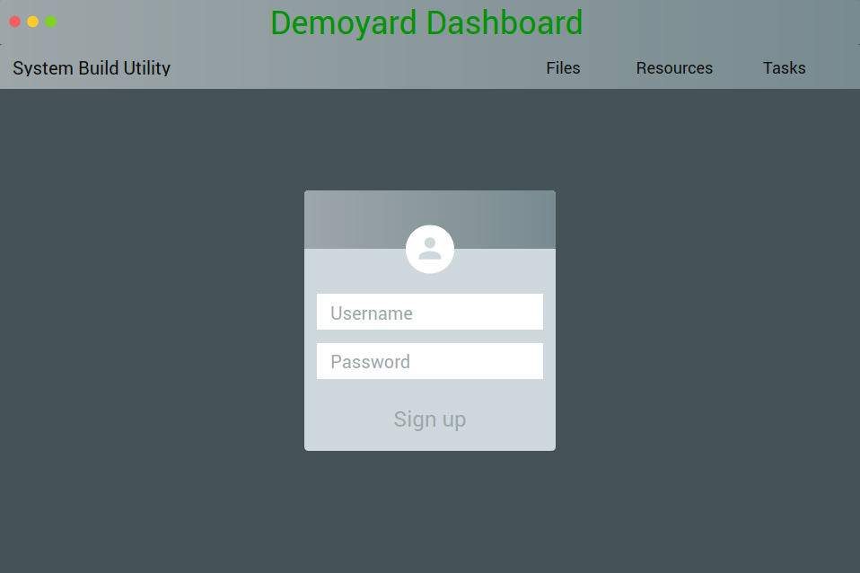
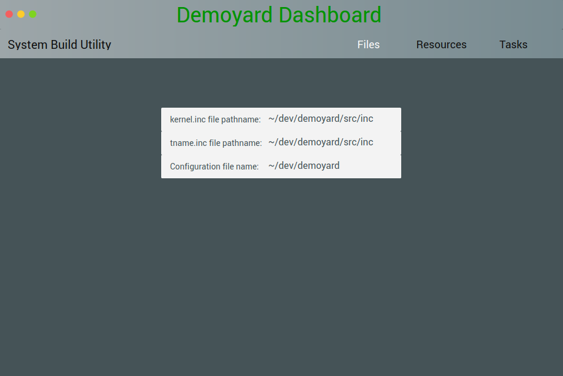
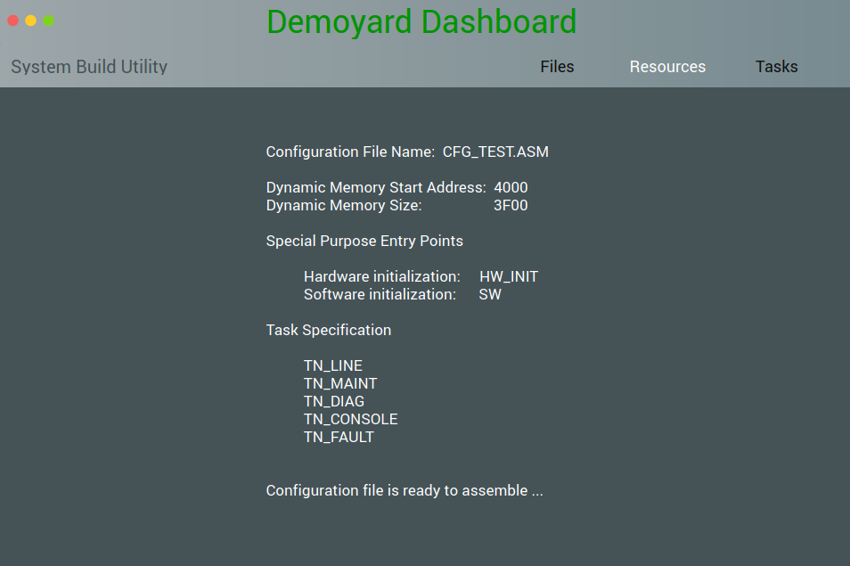
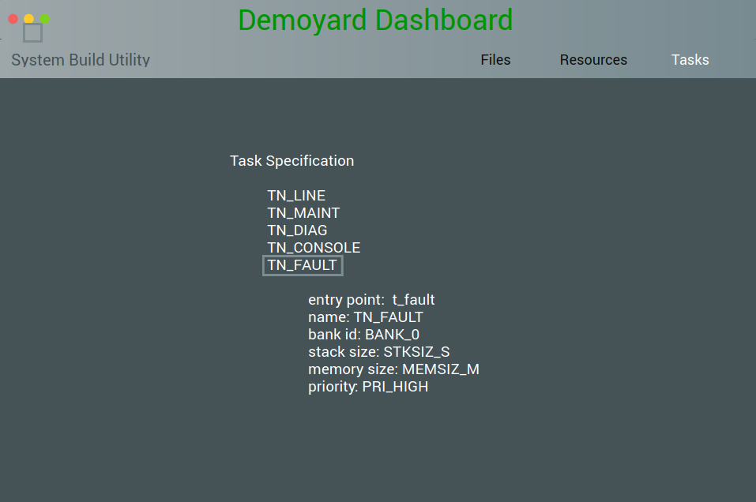

Dashboard User Guide
=========================================================================

This section describes how to use the system build utility.

The system is built by responding to prompts for configuration information.  The utility uses the information to produce an assembly language source file.  This file is then assembled and linked with the rest of the system files using the linker.

There are three types of information to enter; 1) the location of include files used by the source file, 2) a description of the run-time environment and resources, and 3) the task descriptions.

If entry errors cause invalid data to be defined or run-time faults, the utility exits without generating the assembly file.

In some cases, warning messages are displayed to draw attention to potential conflicts.  However, processing may continue if the warning is not significant for the application.

The user is prompted for data entry by cursor or highlighted field.  Data entry terminates with a CARRIAGE RETURN or when the input field limit is reached.  Where only fixed options are allowed, the options are toggled with the SPACEBAR and accepted with a CARRIAGE RETURN.

Help is always provided on the last line of the screen.

File Location
-------------

This screen is used to enter include file pathnames used in the configuration file.  The name of the output file is also entered.  Any valid DOS path- and filename may be entered.

A.  These include files are installed with the kernel.  The pathname where the files currently reside, and where they can be located by the assembler, is entered.

B.  This is the complete name of an assembly language include file that defines task names.  The file is provided by the application developer.

C.  This is the name of the output file generated by the build utility.  Any valid DOS filename may be entered, including a filename extension, as required by the assembler.  If the file already exists, the build utility terminates with an error message.

The following figure shows the final screen displayed when the system is successfully built.

A.   This is the name of the output file.  The file is an ASCII file, which may be edited before assembly if needed.

B.  This box indicates successful configuration file creation, the name of the file, and displays any warnings that occurred during the build procedure.

When ready, press any key to complete the system build operation.

Resource and Environment Definition
-----------------------------------

A.  This line displays the output file name entered on the previous screen.

B.  The kernel and application dynamic memory start address and size are entered in hexadecimal.  The kernel compares resource requirements, during the system build, against this available memory.

C.  Enter a decimal value for the desired number of each resource.  Only values within kernel limits for a specific resource may be entered.  If resources require more memory than has been allocated, the program terminates with an error.

D.  Initialization entry points and task names are optional.  If an item is not needed for the application, accept the default, NOT USED, by pressing CARRIAGE RETURN.

To provide automatic initialization and to support bank switching, enter the name of the functions entry point.  Case significance depends on the assembler option settings.

The existence of the entry points is not checked by the build utility, but if they do not exist, an unresolved external fault occurs when the system is linked.

The fault handler task name is a literal constant and not an entry point.  If a fault handler task is used for fault reporting at run-time, the name must be defined in include file TNAME.INC.

G.  A help line provides direction if needed.

Task Definition
---------------

E.  This section defines the tasks.  Task names must be defined in include file TNAME.INC and task entry points must exist or an unresolved external occurs when the system is linked.

The remaining task attributes are selected from option constants; the option meaning is defined and may be changed, in include files IF_K_L.INC and IF_K_L.H.

Memory availability is checked for each task.

When all tasks are defined, press ESC at the entry point prompt to complete the system build.

F.  A list of defined tasks is displayed.
