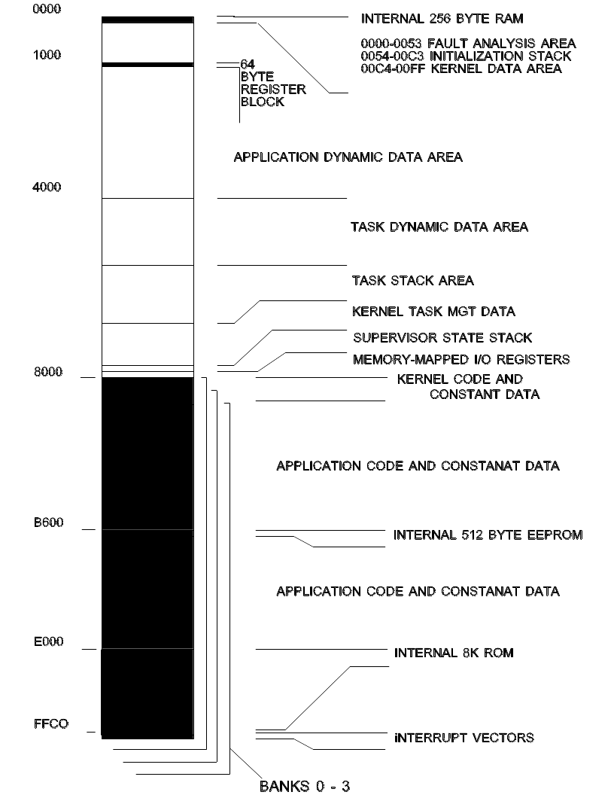

Memory Allocation
=========================================================================

One of the resources managed by the kernel is memory.  This section presents the kernel view of memory management policies.

Memory Layout
-------------

The following page shows a typical memory map for a microcontroller with internal RAM, ROM, and EEPROM.  The map can be applied to other versions by accounting for the different types of memory available and their location.

The kernel, itself, does not place restrictions on memory type or location, except for the 256 bytes from locations 0000H to 00FFH.  This is the only memory used by the kernel that is required to be at a fixed location.

The kernel code may be located in RAM or ROM.

The example shows a system with external RAM beginning at address 0000H, and external ROM or RAM beginning at address 8000H, for the full 64K address space.  Memory banks, up to a maximum of four, are shown in the upper half of the address space.

INTERNAL 256-BYTE RAM
^^^^^^^^^^^^^^^^^^^^^^^^^^^^^^^^^^^^^^^^^^^

This area is used by the kernel for fault management and control information.  Locations 0054H to 00C3H are used as the stack area during initialization.  Once the task state is entered, these locations are available to the application.  However, these data are not preserved on a system restart.

64-BYTE REGISTER BLOCK
^^^^^^^^^^^^^^^^^^^^^^^^^^^^^^^^^^^^^^^^^^^

These control registers may be located on any 4K byte boundary.  The kernel uses configuration file data to set the registers' location.

APPLICATION DYNAMIC DATA AREA
^^^^^^^^^^^^^^^^^^^^^^^^^^^^^^^^^^^^^^^^^^^

This area is memory, which is not specifically dedicated to a task.  For example, database memory or for abstract data type instances.

The kernel provides no protection mechanisms for accessing this memory.

This memory is not accessed by the kernel, except during the initialization RAM test.

TASK DYNAMIC DATA AREA
^^^^^^^^^^^^^^^^^^^^^^^^^^^^^^^^^^^^^^^^^^^

This area is divided into partitions, each of which is dedicated to a specific task.

The kernel dynamically allocates blocks of this memory to tasks at initialization.  The size is defined in the configuration file.  The kernel never makes the location available to a task that does not "own" the partition.

The kernel never accesses this area, except during the initialization RAM test.

TASK STACK AREA
^^^^^^^^^^^^^^^^^^^^^^^^^^^^^^^^^^^^^^^^^^^

Task stacks are located in this area.  There is a separate area for each task.

The kernel also uses this area to save the task context when a task is suspended.

Interrupts also use the task stack area, unless the ENTER_ISTATE primitive is called by the interrupt service routine.

KERNEL TASK MANAGEMENT DATA
^^^^^^^^^^^^^^^^^^^^^^^^^^^^^^^^^^^^^^^^^^^

Kernel and task RAM requirements are application-dependent and are derived from configuration file entries.  The following values are used to determine the amount of RAM needed for the kernel.

    256 bytes for the kernel and supervisory state stack

    512 bytes for kernel time management services

      6 bytes for kernel message services.

TOTAL FIXED RAM NEEDED:  774 bytes

Variable memory sizes are calculated, based on the number of tasks and resources.

      6 bytes are needed for each queue resource

      8 bytes are needed for each of semaphore resource

      9 bytes are needed for each messages buffer resource

     32 bytes are needed for management of each task

MINIMUM RAM NEEDED:
(at least one task and no resources defined)

    806 bytes

SUPERVISOR STATE STACK
^^^^^^^^^^^^^^^^^^^^^^^^^^^^^^^^^^^^^^^^^^^

This is the common stack area for the kernel supervisor state and interrupts.

Use of this area for nested interrupts, by calling ENTER_ISTATE from the interrupt service routine, reduces task stack requirements.

MEMORY-MAPPED I/O REGISTERS
^^^^^^^^^^^^^^^^^^^^^^^^^^^^^^^^^^^^^^^^^^^

This memory type may or may not be present, depending on the hardware design.

It includes registers used to access peripheral devices, external to the microcontroller.

KERNEL CODE AND CONSTANT DATA
^^^^^^^^^^^^^^^^^^^^^^^^^^^^^^^^^^^^^^^^^^^

The kernel needs less than 2500 bytes for code space, located either in RAM or ROM.

If multiple banks are used, an instance of the kernel code must reside in each bank and at the same location.

This area is checksummed at initialization, to verify kernel integrity.

APPLICATION CODE AND CONSTANT DATA
^^^^^^^^^^^^^^^^^^^^^^^^^^^^^^^^^^^^^^^^^^^

This area is for non-kernel code and constant data.

If code or data are shared by tasks in different banks, an instance of the shared code and data must reside in the same location in each bank.

INTERNAL 512-BYTE EEPROM
^^^^^^^^^^^^^^^^^^^^^^^^^^^^^^^^^^^^^^^^^^^

This internal EEPROM is available to applications.

This memory is not used by the kernel.

INTERNAL 8K ROM
^^^^^^^^^^^^^^^^^^^^^^^^^^^^^^^^^^^^^^^^^^^

This internal ROM is available to applications.

This memory is not used by the kernel.

INTERRUPT VECTORS
^^^^^^^^^^^^^^^^^^^^^^^^^^^^^^^^^^^^^^^^^^^

These are the hardware interrupt vector registers.  Only the real-time interrupt (RTII), software interrupt (SWI), and RESET vector interrupt are reserved for the kernel.

Task Memory Allocation
----------------------

Tasks require code, stack, and dynamic memory areas.

Dynamic memory is provided as a means of partitioning memory for the exclusive use of the task.  How this memory is allocated and used by the task at run-time, is an issue for application design.  This memory is not used by the kernel or other tasks, although a task may inform other tasks of the location of its dynamic memory.  This memory is never released.

The sizes of each task's stack and dynamic memory areas are defined in the configuration file.  However, the locations of task stack and dynamic memory are determined at initialization.  The primitive, LOCATE_MEM, is used to effectively allocate dynamic memory.
