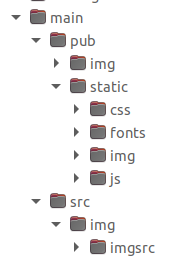

# dore-ssg

The Dore static site generator.

This takes content authored in ReStructuredText and converts it to HTML embedded in a technical documentation theme.

## Prerequisites

- Golang
- Docutils

## Directory Structure Dependencies

<p align="left">
    
</p>

- The .toml configuration file must be in the /main directory.
- The /src directory contains reStructureText source files and image source files.
- The /pub directory contains published content with presentation files in the /pub/static directory.

## Usage

``` bash
    go run .
```
Or, build binary executable.

## TODO:

- search result rendering
- improved code comments
- cleanup CSS and JavaScript
- improved error detection and handling
- populate additional <meta> fields from .toml configuration file
- document constraints on ReST directives
- document process differences from typical SSGs
- syntax highlighting: map additional syntactic elements
- provide templates for document types
- build progress notifications
- provide default feedback mechanism
- support document version selection
- add analytics
